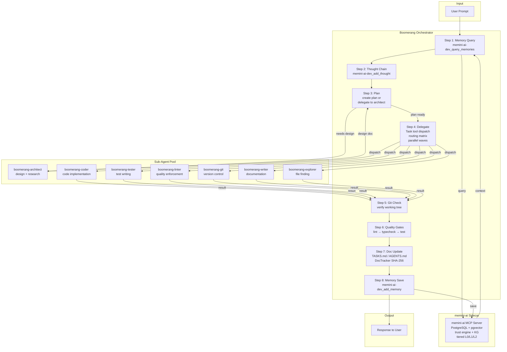

# Architecture

Boomerang v3 is an **orchestration plugin for OpenCode**, not a
standalone agent execution system.

## What Boomerang is

- **Boomerang's role**: Analyse requests, query memory, select the
  appropriate agent, build a rich Context Package.
- **OpenCode's role**: Handle agent execution natively using its own
  agent spawning mechanism.
- **memini-ai's role**: Persistent memory with trust scoring, knowledge
  graph, and tiered loading.

## How it works

<!-- mermaid: dispatch-flow -->


The orchestrator is a **pure decision layer**:

- Analyses the request
- Queries memini-ai for relevant context
- Selects the appropriate agent
- Builds a Context Package
- Returns `{agent, systemPrompt, contextPackage, suggestions}` to
  OpenCode

OpenCode then spawns the selected agent natively. The agent does its
work, saves detailed results to memini-ai, and returns a thin summary
to the orchestrator.

## Orchestrator API

The `BoomerangOrchestrator` class provides:

| Method | Description |
|--------|-------------|
| `analyzeTask()` | Detect task type from request keywords |
| `selectAgent()` | Choose appropriate agent based on task type |
| `queryMemory()` | Search memini-ai for relevant context |
| `buildContextPackage()` | Create rich context for sub-agent |
| `orchestrate()` | Main entry — returns `{agent, systemPrompt, contextPackage, suggestions}` |

## Context Package system

Boomerang passes comprehensive context to sub-agents:

- Original user request (verbatim)
- Task background and constraints
- Relevant files and code snippets
- Expected output format
- Scope boundaries and escalation targets

This ensures sub-agents have everything they need to work effectively.

## Plugin hooks

OpenCode plugins support 25+ lifecycle hooks. Boomerang-v3 is already
loaded as a plugin (`@veedubin/boomerang-v3` in `opencode.json`), so
adding hooks is incremental — just export them from the existing plugin
structure.

Key hooks used or planned:

| Hook | Purpose |
|------|---------|
| `experimental.session.compacting` | Inject boomerang state before compaction (preserves task graph, slot usage, queued jobs) |
| `tool.execute.before` | Validate the mandatory routing matrix |
| `tool.execute.after` | Audit trail for tool calls |
| `session.created` | Session initialisation |
| `file.edited` | Track documentation changes via DocTracker |

> The `experimental.session.compacting` hook is the key to solving
> context loss: it fires before the LLM compaction prompt is generated,
> letting us inject boomerang state that survives context pruning.

See [`docs/CONFIG_RESEARCH.md`](CONFIG_RESEARCH.md) for the full
feature evaluation of plugin hooks, routing validation, and audit
trail.

## Compaction integration

When OpenCode is about to compact the session context, the
`experimental.session.compacting` hook fires. Boomerang uses this to:

1. Snapshot the current task graph, slot usage, and queued jobs.
2. Inject a state summary that survives the compaction prompt.
3. Restore the snapshot on `session.compacted`.

This directly addresses the context preservation problem that plagued
earlier versions of Boomerang.

## Project structure

```
boomerang-v3/
├── src/
│   ├── index.ts              # Plugin interface
│   ├── orchestrator.ts       # Pure decision layer
│   ├── protocol/             # ProtocolAdvisor (mandatory enforcement)
│   ├── execution/            # TaskRunner (prompt builder only)
│   └── agents/               # Agent definitions
├── .opencode/
│   └── skills/               # Skill definitions
├── packages/
│   └── opencode-plugin/      # OpenCode plugin package
├── tests/                    # Test suite
├── AGENTS.md                 # Agent roster
├── README.md                 # This file
└── package.json              # @veedubin/boomerang-v3
```